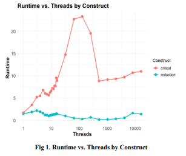
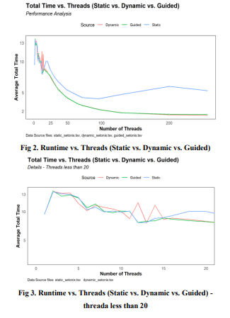
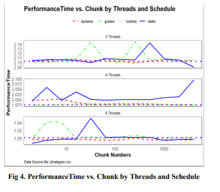
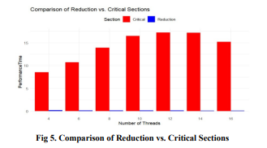
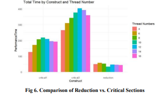

# High-Performance Parallel Optimization of the Fish School Behaviour on the Setonix Platform Using OpenMP

### Abstract

This paper presents an in-depth investigation into the high-performance parallel optimization of the Fish School Behaviour (FSB) algorithm on the Setonix supercomputing platform using the OpenMP framework. The FSB algorithm, inspired by nature's social behavior patterns, provides an ideal platform for parallelization due to its iterative and computationally intensive nature. The study leverages the capabilities of the Setonix platform and the OpenMP framework to analyze various aspects of multi-threading, aiming to discern patterns and strategies that can elevate program performance.

### How to compile and run the code?
In Linux Environment:

### gcc -fopenmp -o executable_name source_code.c

### ./executable_name

### 1. Introduction

#### 1.1 Background

With the rapid advancements in scientific research and technology, there has been an escalating demand for computational power, especially for large-scale and intricate calculations. High-performance computing (HPC) plays an instrumental role by enhancing computational speeds through optimized parallel algorithms and frameworks. The Fish School Behaviour (FSB) algorithm, a variant of Particle Swarm Optimization (PSO), stands out as an ideal candidate for parallelization, offering a robust experimental platform for HPC research.

#### 1.2 Objectives

The central objective is to harness the computational prowess of the Setonix platform and the OpenMP framework to conduct high-performance parallel optimization of the FSB algorithm. The study delves deep into the impact of various multi-threading facets on program performance, examining thread counts, scheduling strategies, and OpenMP constructs.

### 2. Methodology

#### 2.1 Experimental System Configuration

Ensuring consistent starting conditions across experiments is pivotal to warranting the comparability of the results. The initialization and characteristics of the fish population, pond simulation environment configuration, and system parameter configuration are outlined.

#### 2.2 Parallelization Strategy

To enhance simulation efficiency, the OpenMP framework is employed. The introduction to the OpenMP framework and the definition and selection of independent variables, including thread count, scheduling strategy, block size, and parallel structure, are discussed.

#### 2.3 Experimental Design

Utilizing the OpenMP parallel computing paradigm, critical independent variables are scrutinized to discern their impact on holistic system performance. Benchmark settings and three experiments focusing on thread count, scheduling strategy, and parallel constructs are detailed.

### 3. Experimental Results and Data Analysis

#### 3.1 Experimental Configuration

The configuration for the experimental environment, including operating system information, kernel version, and compiler version, is provided.

### 3.2.1 Reduction Construct vs. Critical Construct with Static Scheduling

Our analysis focused on the impact of Reduction Construct and Critical Construct on runtime under static scheduling. Results indicate that, with an increasing thread count, programs using Reduction Construct generally exhibited shorter runtimes than those with Critical Construct. This efficiency advantage of Reduction Construct became more pronounced at medium thread counts (e.g., 64 or 128), although the gap reduced at higher thread counts. Critical Construct's runtime remained constant with increasing thread counts, exhibiting a linear growth up to 100 threads and then a decrease, reaching a minimal value at 800 threads.

### 3.2.2 Static vs. Dynamic vs. Guided with Reduction Structure

Examining three scheduling strategies (static, dynamic, and guided) with Reduction Construct, dynamic and guided strategies consistently outperformed static, especially beyond 20 threads. Below 20 threads, runtime differences were marginal, but dynamic and guided strategies improved performance by up to 50% with higher thread counts.

### 3.3.1 Analysis of Scheduling Strategy's Impact on Runtime

The impact of different scheduling strategies on the execution time of the Reduction Construct at various thread counts was considered. Dynamic and guided strategies consistently performed better than static, with minimal runtime fluctuations.

### 3.4 Experiment 3: Influence of Constructs on Program Runtime

This experiment focused on three constructs—Reduction Construct, Critical Partial Construct, and Critical Construct. The Reduction Construct consistently yielded optimal performance regardless of thread count settings, demonstrating efficiency amplification with increased usage in the program.

#### 3.4.1 Analysis of Constructs' Impact on Runtime

Comparing the runtime of the "eat" module section using Reduction Construct and Critical Partial Construct, Reduction Construct excelled in runtime, exhibiting thread count independence, while Critical Partial Construct showed an increase-then-decrease trend.

Subsequently, as depicted in Figure 6, we compared the overall program runtime using the Reduction 
Construct, Critical Partial Construct, and Critical Construct. The outcomes underscored that the 
Reduction Construct consistently yielded optimal performance regardless of thread count settings, with 
efficiency amplifying the more it was utilized in the  program

### 4. Conclusion
When comparing overall program runtime using Reduction Construct, Critical Partial Construct, and Critical Construct, Reduction Construct consistently outperformed, demonstrating optimal performance across various thread counts.

This experiment centers on three different constructs—Reduction Construct, Critical Partial Construct, and Critical Construct—and their influence on program runtime, given other variables remain constant. Detailed analysis and conclusions based on experimental data are provided.

#### Key findings regarding the impact of thread count, choice of scheduling strategy, and construct selection are summarized.  

## You can look through the details in the Thesis.pdf

## ExperimentCode List

### critical1.c

### critical2.c

### reduction.c

### static_dynamic_guided.c

